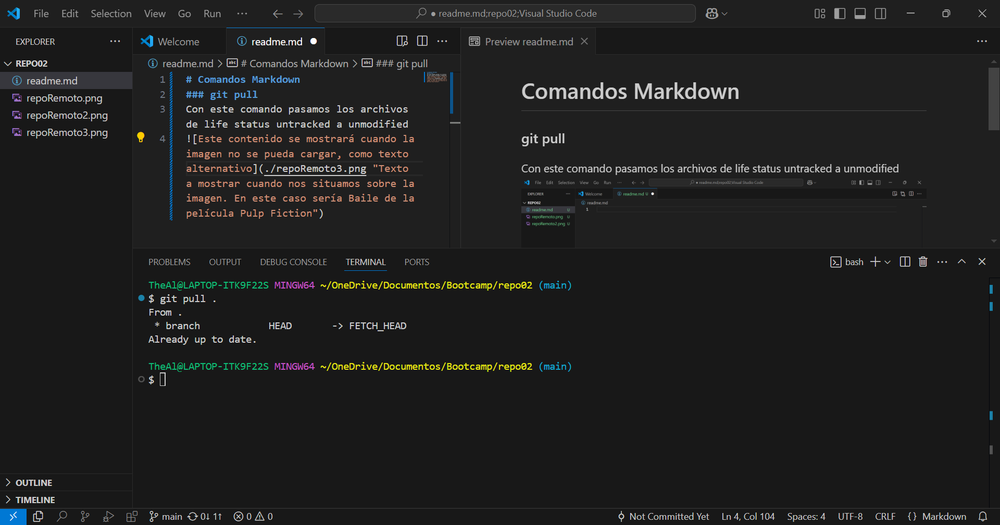
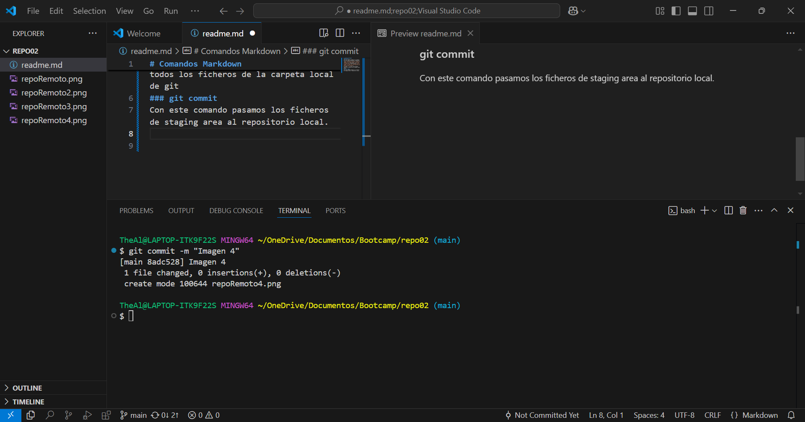
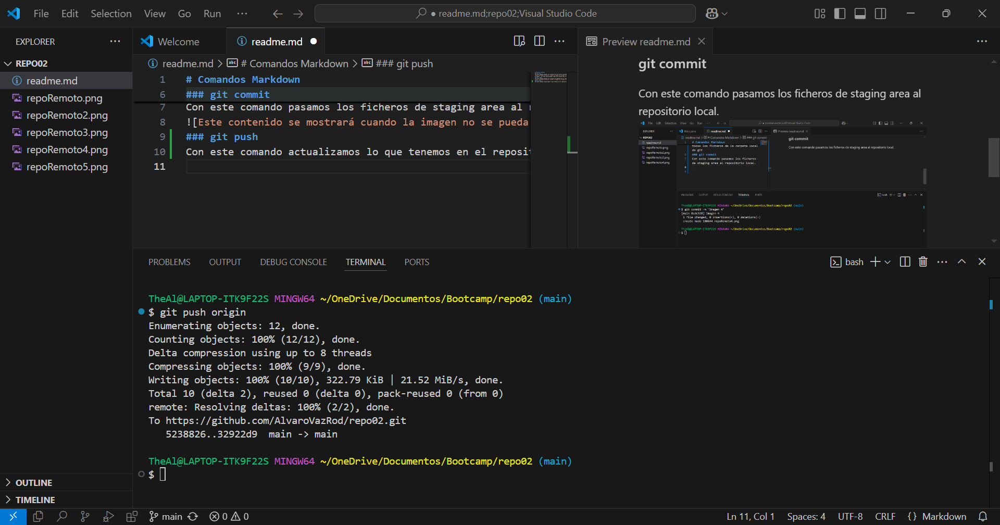

# Comandos Markdown  
### git pull  
Con este comando pasamos los ficheros de life status untracked a unmodified 
  
Al añadir . al final seleccionamos todos los ficheros de la carpeta local de git 
### git commit  
Con este comando pasamos los ficheros de staging area al repositorio local.  
  
### git push  
Con este comando actualizamos lo que tenemos en el repositorio local al repositorio remoto.
   
Añadimos al final origin que es la rama a la que queremos añadir ese push.